# README

## アプリ概要

どんなことをどのくらい頑張るのか、ペースと目標値を自分で設定し、習慣化をサポートするアプリです。

## 使用技術

html ,css,javascript,
ruby,ruby on rails,postgresql

## 機能一覧

・新規登録

・ログインおよびログアウト

・習慣の追加

・成果の入力および入力履歴の表示

・習慣内容の編集

・グラフで進捗の確認の確認

・習慣の検索及びソート

・習慣の一括削除

## 使用方法

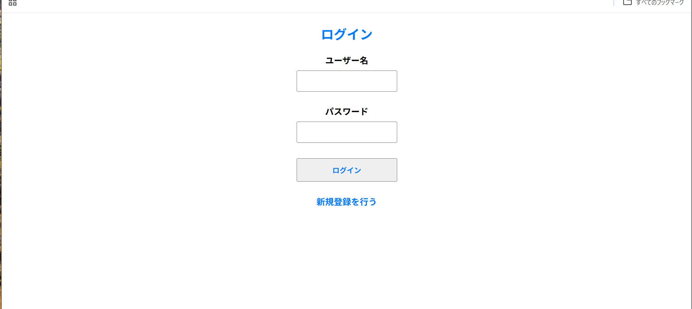

アプリにアクセスすると上記の画面が表示されるので、ユーザー名とパスワードを入力します。初めてアクセスするという場合、「新規登録を行う」ボタンから登録画面へアクセスし、ユーザー名とパスワードを登録します。

新規登録またはログインをすると、上記のようなホーム画面に移動します。この画面では、習慣の追加や編集、グラフでの進捗確認、習慣の一括削除などができます。

ホーム画面左上の「習慣を追加する」ボタンをクリックすると、上記のような習慣入力画面に移動します。

ここでは、どんなことを、どれくらいのペースでどれだけ頑張るか、自分で設定することができます。この例では、1日に1キロのジョギングを習慣として設定しています。

「習慣タイプ」の項目は、「やるべきこと」か「やめるべきこと」のどちらか一つを選択します。例えば、運動や勉強といった何かを行う習慣の場合「やるべきこと」を選択し、糖質制限や禁酒、禁煙などの場合、「やめるべきこと」を選択します。

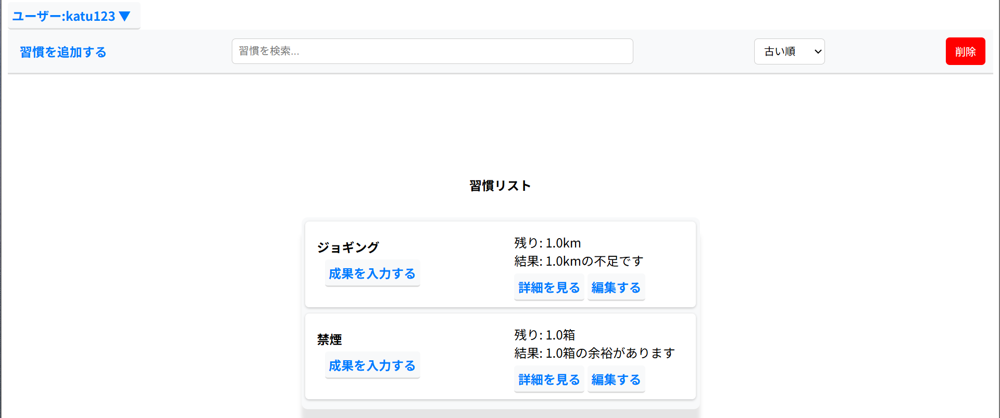

習慣追加フォームですべての項目に入力し終え、「追加する」ボタンをクリックすると、ホーム画面の習慣リストに設定した内容通りの習慣が追加されます。

「やるべきこと」の習慣は、自分で設定した値がそのままノルマの初期値になります。ジョギングは1日1キロを目標値として設定したため、「１km不足しています」と表示されます。このノルマは、1日ごとに増えていきます。

「やめるべきこと」の習慣は、自分で設定した値がストック(消費していい分)の初期値になります。禁煙は3日に一箱と設定したため、「1箱の余裕があります」と表示されます。このストックは、3日ごとに増えていきます。

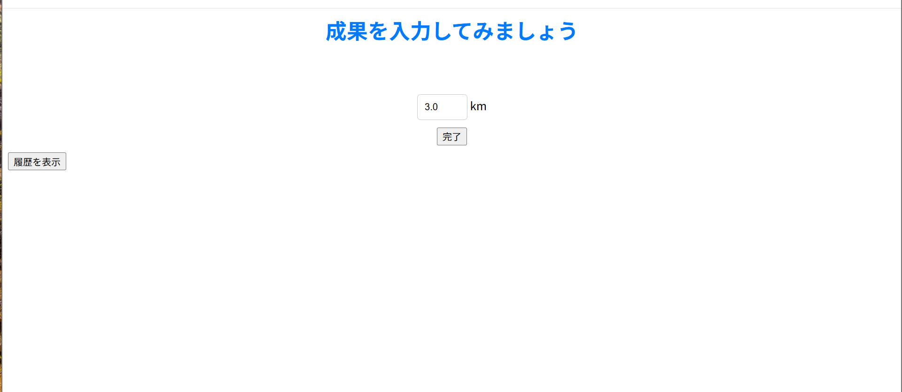

「成果を入力する」ボタンをクリックすると、入力画面に移行します。例えば、ジョギングを3km行ったなら、上記のように入力します。

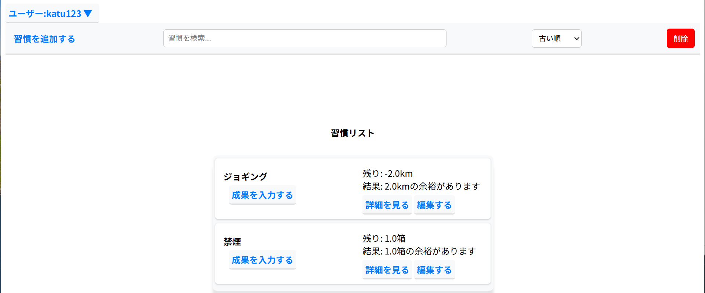

入力画面で「完了」ボタンをクリックすると、一覧画面に成果が反映されます。ジョギングは元のノルマが1kmであったのに対し実際に行った距離が3kmであったため、余剰分の2㎞が加算され、「2kmの余裕があります」というメッセージに変化しています。

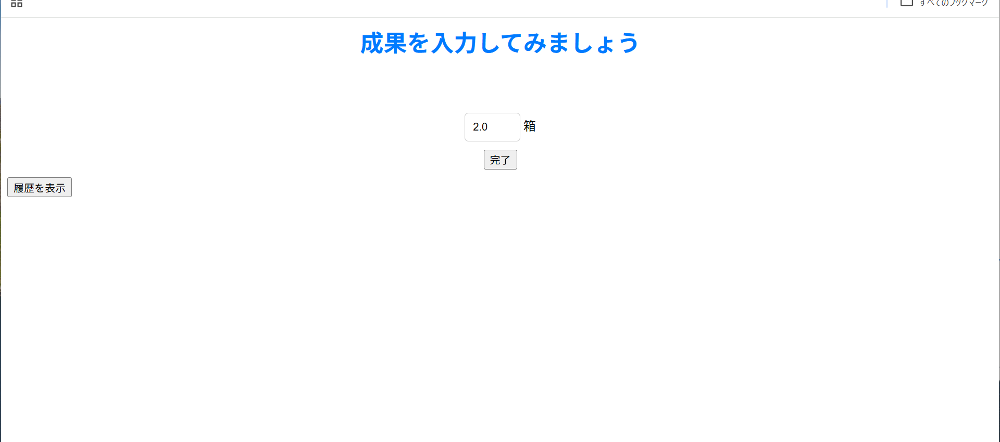

禁煙の成果も入力してみます。禁煙のような「やめるべきこと」タイプの習慣では、実際の消費量を成果として入力します。今回は2箱分喫煙したとします。

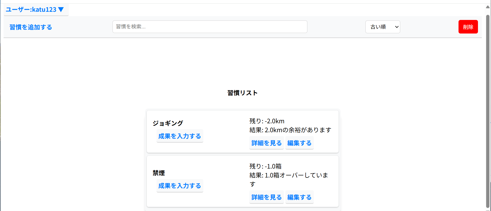

禁煙の習慣は初期のストックが1箱であり、そこから2箱消費したため、「1箱オーバーしています」というメッセージに変化しています。

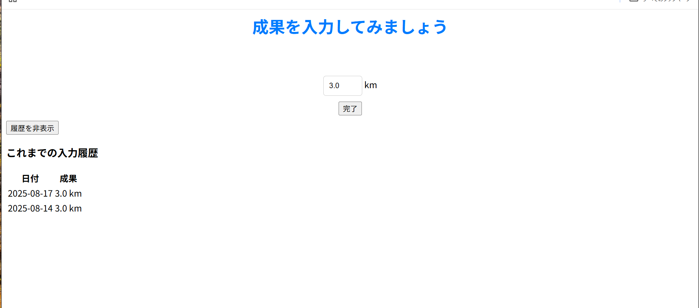

入力した日付と数値は、成果入力画面の「履歴を表示」ボタンで確認することができます。

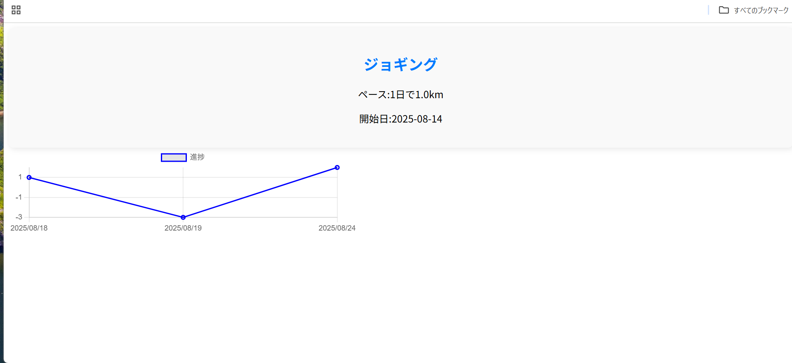
「詳細を見る」ボタンをクリックすると、習慣ごとの数値の推移を確認することができます。

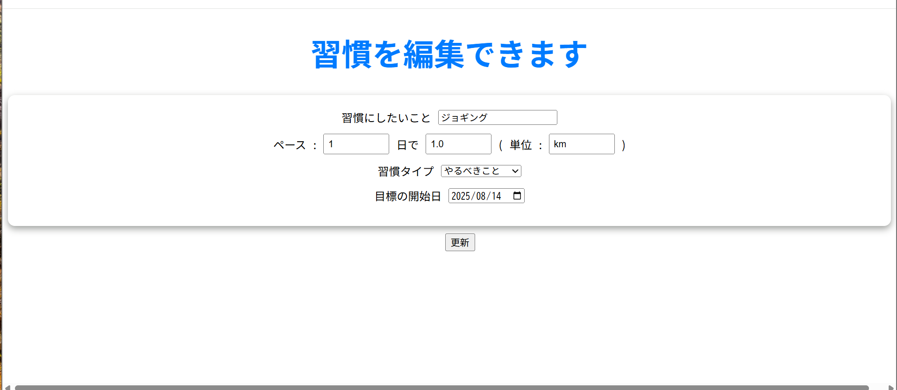
「編集する」ボタンをクリックすると、設定した習慣の名称やペースの数値を変更することができます。

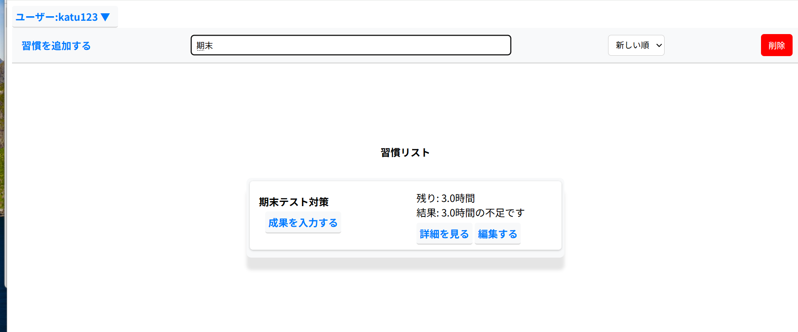
もし習慣の量が増えてきて探すのが難しくなった場合、検索機能を利用すれば簡単に見つけられます。

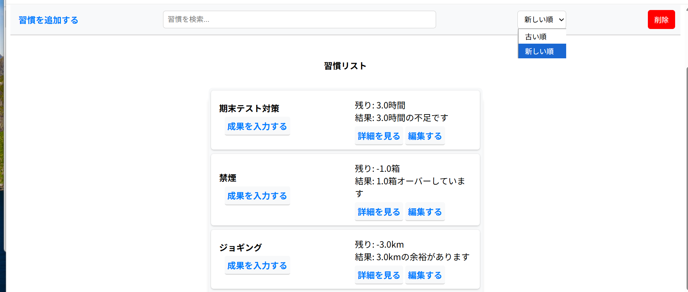
画面右上のソートボタンを利用すれば、習慣を新しい順、古い順に並べることができます。

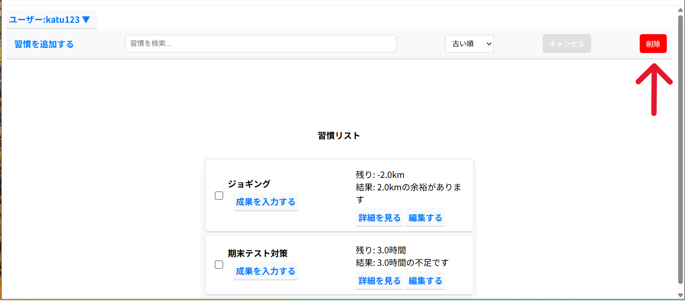

画面右上の削除ボタンをクリックすると、習慣の削除を行うことができます。ボタンクリック後、各習慣の左にチェックボックスが表示されるので、削除したい習慣にチェックを入れます。

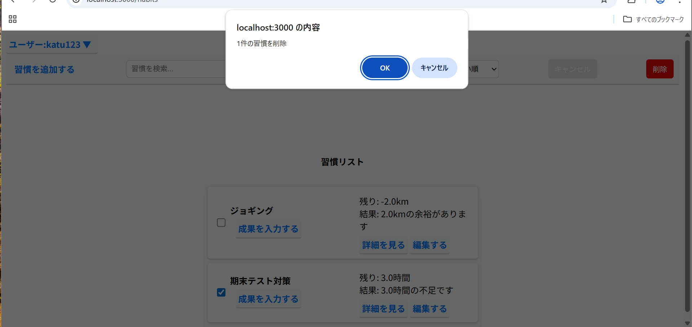
チェックを入れた後にもう一度削除ボタンをクリックするとこのようなメッセージが表示されるので、OKを押せば削除が行われます。

## 制作背景

プログラミングの学習を継続的に行うために、習慣を維持できるような仕組みを作る必要があると考え、自分でペースを設定する仕組みを作りました。自分で設定した期間ごとに数値を増減させる作業を手動で行うのは手間がかかるため、それを自動で行ってくれるアプリを作ってみたいと考えるようになり、開発に挑戦しました。

